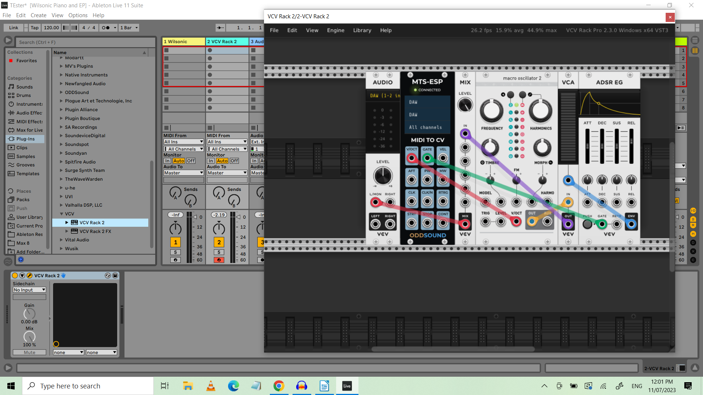
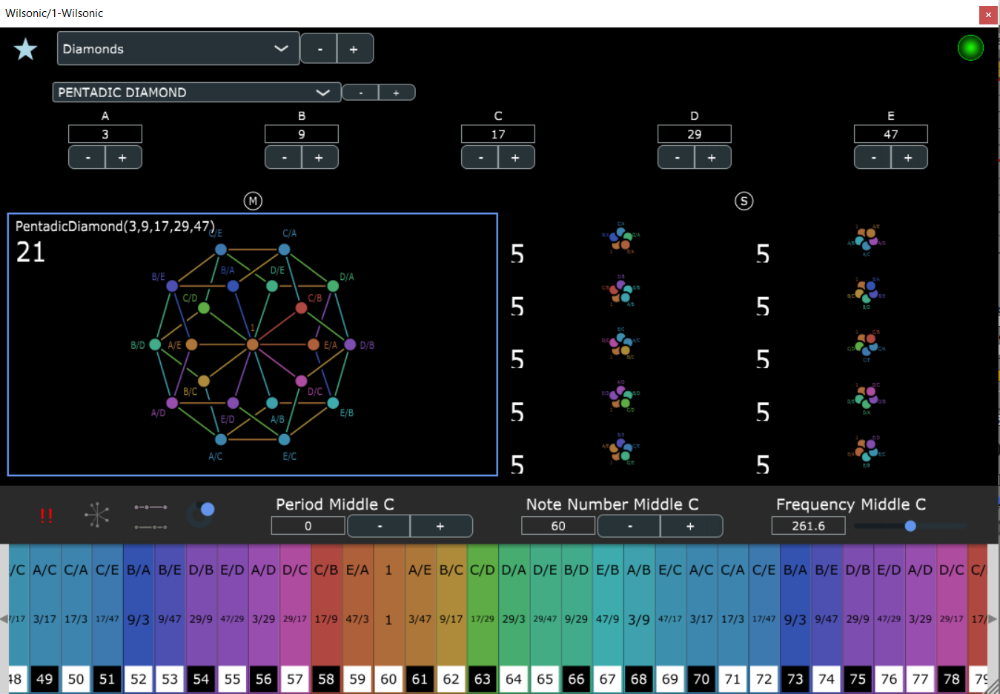

# MTS-ESP -- the technology that allows all this to happen:

ODDSound is a British company consisting of Oli Cash, Damon Hancock and
Dave Gamble. Initial design help with the initial concept of MTS-ESP
also came from Richard James (Aphex Twin). The idea behind this program
was to find a way to implement the MTS (MIDI Tuning Standard) Single
Note Change message. Once this was done, a single Master Tuning Table
could be made which provided tuning information to all the compatible
synthesizers on the system. Implementing this in various softwares
proves relatively easy. The MTS-ESP library is a simple but versatile
C/C++ library for adding microtuning support to audio and MIDI plugins.
Connection between a master and clients is automatic and invisible.
Integration of the code with the existing synthesizer code is simple and
typically takes less than half an hour.  (*ODDSOUND*, n.d.)

As a program., MTS-ESP consists of three sub-programs. MTS-ESP Master is
the program in which tuning information is defined, and operations on
existing tunings are made. The program can hold up to 128 different
tunings at any one time, all of them instantly accessible under MIDI
control. The program has a number of other capabilities, such as the
ability to morph and mutate between tunings. For more information
consult the ODDSound website, oddsound.com. There are two other parts to
the program. MTS-ESP MIDI Client allows one to use the existing tuning
table and apply it to other synthesizers with differing tuning
standards, and MTS-ESP Mini is a free auxiliary program that allows the
capabilities of MTS-ESP Master to be applied to any number of
synthesizers, but with only one scale at a time. Taken together, these
programs provide a powerful means of microtuning computer instruments.
(Additionally, ODDSound, in collaboration with the VCV project, has made
a set of MTS-ESP modules which enable using the MTS-ESP standard in
conjunction with the virtual analog VCV environment. And the Surge-Synth
Team has developed the CLAP plugin standard which enables, among other
things, MTS-ESP control of all the plugin synths in Bitwig Studio. More
on this later in the paper.)

# Wilsonic

Wilsonic is a project of Marcus Hobbs and friends that allows one to
explore the tuning universe of Ervin Wilson (1928-2016), the
Mexican-American music theorist who extended tuning theories established
by Harry Partch into a huge and multi-faceted universe. (*A BIOGRAPHY of
ERV WILSON*, n.d) It originally existed as an iOS app for the iPad, and
fed its tuning information into two iOS synthesizers: Audiokit Synth One
and Digital D1. It provided an extremely low-cost and easy-to-use
introduction to the tuning universe of Ervin Wilson. (*Wilsonic*, 2019)
I've used this in a number of pieces of mine. (*Warren Burt Performs "6
Wilson Tunings" at the Make It up Club*, n.d.)

The new version of Wilsonic is several of orders of magnitudes more
powerful. (*Wilsonic: Interactive Emotional Palettes of Music*, n.d.)
Still in beta, as this is being written, it's already made available a
very powerful set of compositional tools. Currently available on both
Mac and PC platforms, it currently consists of 11 pages, each of which
encompasses many variations on the larger categories covered by Wilson's
work. On each page, each scale has a number of factors that can be
changed in real time, and these changes can be recorded in the DAW used
as a framework for the program. For example, in the Combination Product
Set page, each CPS is made by multiplying a number of factors to make
the overall structure of the scale. Any of these factors can be changed,
using push-buttons, or by typing in the numbers themselves, and these
changes will be recorded by the DAW software and the changes will then
be displayed and the changes made available to the current scale. In
this way, you can establish a sense of modulation and harmonic
progression in family of scales being generated. (Narushima, 2018)

The eleven currently existing pages (more are yet to come) are:

- Wilson's Garden -- a curated selection of Wilson's scales from the people behind the program.
- Moments of Symmetry -- the generalized mathematical prototype for the diatonic scale available in an infinity of variations. This page also generates generalized keyboard patterns for the scale being worked on.  (*INTRODUCTION to ERV WILSON'S MOMENTS of SYMMETRY*, n.d.)
- Persian 17 North Indian -- Wilson's theory of the derivation of North Indian ragas from a 17 note Persian master scale.
- Combination Product Sets -- many scales produced by multiplications of basic harmonic factors multiplied against each other.  (*WILSON ARCHIVES - COMBINATION PRODUCT SETS - CPS*, n.d.)
- Euler Genus 6 -- a twenty note scale made from 6 factors, and all the subsets of that particular scale, which have 15, 10, 6, or 5 elements.
- Recurrence Relations -- the Fibonacci series is the recurrent sequence prototype here, but there are many different recurrence relations available, each with many generating factors.  (Wilson, 1993)
- Equal Temperaments -- not just octave related, but any number of divisions of any interval up to 128. All variations are recorded in real-time for changing temperaments.
- Tritriadic Scales -- a generalisation of John Chalmers' method of generating scales. Again, all variations can be recorded in real time for changing scales.
- Scala -- a utility for accessing scales derived from Scala files. The "complete" Scala archive (5158 scales in the most recent version) is available in the "bundled" page, and the "user" page allows you to add your own. Any changes in scales made during a piece can be recorded, allowing for continually changing modulations.
- Co-Prime Grid -- this sets up a grid of criss-crossing harmonic and subharmonic relations. The tonality diamonds of Partch and Novarro are the prototype here. This diagram will also allow those with touch-screens to play these scales as if on a touch-sensitive keyboard. (Wilson, 1999)
- Diamonds -- these are cross sets of all the ratios of between 3 and 8 factors. Each page then has the complete scale and all the harmonic and subharmonic subsets available in that scale. Again, any changes made during performance will be recorded allowing for far-reaching progressions and modulations. (Wilson, 1970)

It can be seen from even these brief descriptions that the tuning
universe of Erv Wilson is immense, and this program allows you to start
exploring that world in some detail. For a deeper look, go to
wilsonic.co and download the current beta version of the program for
your relevant platform.

# Manufacturers coming on board with the MTS-ESP standard.

All these capabilities would not be useful if there was not an adoption
of the MTS-ESP standard by a large portion of the industry. Happily,
this has been the case. Many manufacturers have adopted the MTS-ESP
standard, meaning their softsynths immediately adapt to the tuning of
the moment. If the scale changes, the tuning of the scale in the synth
immediately changes as well, reflecting the current tuning. Here's a
brief list of companies who have adopted the MTS-ESP standard for their
synthesizers, and the names of those synthesizers. Some of these are
free, and some are paid products, but all that I have tested respond
immediately to changes in tuning in the MTS-ESP Master, or in Wilsonic.
This list is current as of July 21, 2023. Other makers will undoubtedly
join this list soon. The rapid adoption of the standard has been quite
gratifying to see. For the most recent updated list, go to
<https://oddsound.com/usingmtsesp.php>.

- Antares: Auto-Tune Slice
- Audio Damage: Continua / Phosphor / Slice
- Audio Nebula: Aurora FM
- Audiorealism: Bass Line 3 / ReDominator
- Arturia: Augmented Strings / Augmented Grand Piano / Augmented Brass / Augmented Voices / Buchla Easel V / Clavinet V / CMI V / CS80 V / CZ V / DX7 V / Emulator II V / Jun-6 V / Jup 8 V / MS 20 V / OP Xa V / Piano 3 V / Pigments 4 / Prophet 5 V / Prophet VS V / SQ80 V / Stage 73 V / Synthi V / Vocoder V
- bitKlavier: bitKlavier
- ChowDSP: Chow Kick
- CWITec: TX16Wx
- discoDSP: OP-Xd
- DMG Audio: EQuilibrium / Pitch Funk
- DS: Thorn
- Entonal Studio: Entonal Studio
- Expert Sleepers: Silent Way
- FabFilter: Twin 3
- Full Bucket Music: FB-7999 / Fury 800 / Grain Strain / ModulAir / WhispAir / Bucket One / Qyooo / Scrooo / MPS (and others)
- Hy-Plugins: HyPoly
- Infinitone: Infinitone DMT
- Modartt: Pianoteq
- Monoplugs: Monique
- Nakst: Altitude / Apricot / Integrate / Fluctus / Regency
- Newfangled Audio: Generate / Pendulate
- NuSofting: Sinmad / Sunnah
- Plogue: Bidule / Chipsynth MD / Chipsynth OPS7 / Chipsynth PortaFM / Chipsyntth SFC
- Rhizomatic: Plasmonic
- SoundDyan: Interstellar Waterphone / Zanza amd Kalimba
- Surge: Surge XT / MTS-ESP to Note Expression CLAP
- TAL Togu Audio Line: TAL-BassLine 101 / TAL J-8 / TAL-MOD / TAL Sampler / TAL-U-No-LX
- u-He: ACE / Bazille / Beatzille / Colour Copy / Diva / Hive 2 / Podolski / Repro / MFM2.5 / Triple Cheese / Zebra 2 / Zebra CM / Zebralette / Zebra HZ
- Unfiltered Audio: Lion
- Virtual CZ: Virtual CZ
- Wilsonic: Wilsonic
- Xfer: Serum

# VCV Rack and Oddsound

Oddsound have made a family of modules for VCV Rack Pro 2. (*VCV Rack
2 - Virtual Eurorack Studio*, n.d.) These enable external MIDI signals
to travel into and out of the VCV Rack environment, while conforming to
the Master MTS-ESP tuning table. This enables a function --it enables
you to patch any synthesizer within VCV and have it play in tune with
the Master tuning table.

{width="6in"}

In this patch, VCV Rack Pro 2 exists as a plug-in in Ableton Live (in
Mixer channel 2). Here's a very simple patch which plays microtonally in
VCV Rack. Much more complex patches are, of course, possible. The
MTS-ESP Module substitutes for the normal VCV Midi-CV module. Polyphony
is set on the back (right-click) of module, making the patch polyphonic.
The Voltage/Oct signal goes into the V/Oct input of an oscillator or
sampler module (in this case Audible Instruments mscro oscillator 2.)
The Gate output on the Midi-to-CV goes to the Gate Input on the ADSR EG
module, which controls the level on the VCA. The tuning accuracy of the
oscillator modules in VCV is fantastic. Very fine control of pitch is
made possible with the virtual analogue modules controlled by the
MTS-ESP standard. Patching like this in VCV is limited to 15 voice
polyphony, but many instances of the VCV Rack Pro 2 plugin can exist in
an Ableton patch at the same time.

# Frameworks for this. 

In this work, I've used 2 programs as a framework for this, Ableton Live, (Ableton, 2019) and Reaper. (*REAPER
\| Audio Production without Limits*, n.d.) I am also assured that Bitwig
Studio will also work for this, and in fact, the teams that developed
Surge XT and Bitwig Studio have recently collaborated on a new plugin
standard called CLAP that is fully MTS-ESP compatible, which makes all
the plugin synthesizers in Bitwig microtonally retunable. (*Bitwig \|
Home \| Bitwig*, n.d.) . I look forward to hearing from other folks as
to what DAW programs they are using to host this work. For my purposes,
the algorithmic resources available in programs like MusicWonk
(*MusicWonk Overview*, n.d.) and Max 8  (Cycling \'74, 2020) , as well
as all the possibilities in the new Max for Live modules, when combined
with the timbral and tuning resources available in the Wilsonic /
MTS-ESP environment, will provide me with compositional possibilities
for quite a while.

# An example of a piece made in this environment

"Pentadic Diamond 3 9 17 29 47 Canon" is a piece made using the Pentadic Diamond available
on the "Diamonds" page in Wilsonic. The Pentadic Diamond is a 21 note
scale made of all the ratio pairs of 5 factors plus a 1/1 in the centre.
So, for example A/B is reflected by its inversion B/A, and this applies
to all 10 possible ratios of the five factors. The page will play the
complete scale of 21 notes, and also all 10 subsets of 5 notes in the
related scales. The notes are selected by a program in MusicWonk, in
which a single Random Walk module makes random walks that traverse a
range of 43 values. This random walk, when applied to the 21 note scale,
covers just over a 2 octave range. However, when applied to any of the
five-note subset scales, then these scales are articulated over a range
of 8 octaves. The rhythms are generated with a probability generator
making patterns of 8, 16, and 24 pulses. This melody is then played and
accompanied by two delayed versions of itself -- the delays consisting
of 386 and 784 pulses -- making a three part canon with each voice
delayed by about 10 seconds. Sections of the piece are delineated by
changing which scale is playing on the page. This is done in real-time,
and the result is part of the piece's recording.

The piece opens with 1 minute of the 21 note scale, covering the
two-octave range. This is followed by 10 sections of 30 seconds each --
each of these 10 sections plays in one of the five-note subset scales.
Each of these covers a range of 8 octaves. Complexity is added by having
the three voices delayed by 10 seconds each. After all 10 five-note
scales are played for 30 seconds each, the piece returns to a final
minute of the 21-note scale. The three voices are played by three
different softsynths, each of which has a different piano type timbre.
The three instruments are an Arturia DX7 clone, the basic Piano timbre
in Pianoteq 8, and the Surge XT electric piano timbre. Because all three
synths are MTS-ESP compatible, the three synths being absolutely in tune
poses no problems. The structure is actually a very simplistic one, but
the kinds of rhythms generated and the canonic structure gives the piece
what to my ear is an "ear-catching" kind of cross-rhythm and registral
change. It's a rather simple piece, but it shows some of the
compositional possibilities now available with this new microtonal
composing eco-system.

{width="4.5in"}

# References

```{=latex}
\begin{hangparas}{1.5em}{1}
```

*A BIOGRAPHY OF ERV WILSON*. (n.d.). Www.anaphoria.com. Retrieved
September 21, 2023, from <https://www.anaphoria.com/wilsonbio.html>

*ODDSound*. (n.d.). Oddsound.com. <https://oddsound.com/usingmtsesp.php>

*Wilsonic*. (2019, March 5). App Store.
<https://apps.apple.com/us/app/wilsonic/id848852071>

*Warren Burt performs "6 Wilson Tunings" at The Make It Up Club*.
(n.d.). Retrieved September 21, 2023, from
<https://www.youtube.com/watch?v=9MGEA3s5Bk8>

*Wilsonic: Interactive emotional palettes of music*. (n.d.). Wilsonic -
Interactive Musical Scale Design. Retrieved September 21, 2023, from
<https://www.wilsonic.co>

Narushima, T. (2018) *Microtonality and the Tuning Systems of Erv Wilson*. Routledge & CRC Press. DOI: <https://doi.org/10.4324/9781315718583>

*INTRODUCTION TO ERV WILSON'S MOMENTS OF SYMMETRY*. (n.d.).
<www.anaphoria.com>. Retrieved September 21, 2023, from
<https://www.anaphoria.com/wilsonintroMOS.html>

*WILSON ARCHIVES - COMBINATION PRODUCT SETS - CPS*. (n.d.).
Www.anaphoria.com. Retrieved September 21, 2023, from
<https://www.anaphoria.com/wilsoncps.html>

Wilson, E. (1993). *The Scales of Mt Meru* \[Review of *The Scales of Mt
Meru*\]. Anaphoria.com. (n.d.). Anaphoria.com.
<https://www.anaphoria.com/meruone.pdf>

Wilson, E. (1999, November 26). *CoPrime Square Grid* \[Review
of *CoPrime Square Grid*\]. Anaphoria.com.

Wilson, E. (1970). *Triadic Diamond* \[Review of *Diamond Formations*\].
<https://www.anaphoria.com/diamond.pdf>

*VCV Rack 2 - Virtual Eurorack Studio*. (n.d.). Vcvrack.com.
<https://vcvrack.com/Rack>

Ableton. (2019). *New in Live: Discover the new features Ableton Live 10
has to offer \| Ableton*. Ableton.com. <https://www.ableton.com/en/live/>

*REAPER \| Audio Production Without Limits*. (n.d.). Www.reaper.fm.
<https://www.reaper.fm/>

*Bitwig \| Home \| Bitwig*. (n.d.). Www.bitwig.com.
<https://www.bitwig.com/>

*MusicWonk Overview*. (n.d.). Algoart.com. Retrieved September 21, 2023,
from <http://algoart.com/help/musicwonk4/MusicWonk/intro.htm>

Cycling \'74. (2020). *What is Max? \| Cycling '74*. Cycling74.com.
<https://cycling74.com/products/max>

```{=latex}
\end{hangparas}
```